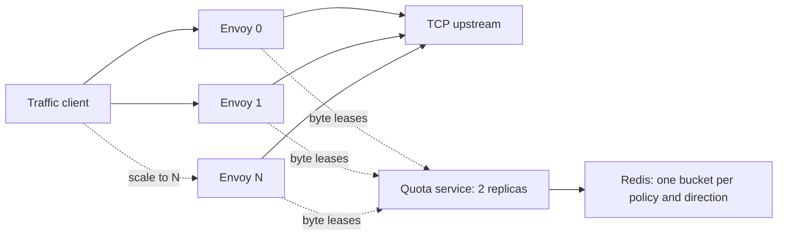

# Distributed TCP bandwidth demo

This runs real Envoy TCP filters with static configs in the dedicated kind cluster
`bandwidth-testing`. ECP is not deployed. The default is **1024 KiB/s upload and
1024 KiB/s download, each shared across all Envoy replicas**.

[Recorded results](RESULTS.md): all seven checks passed on September 30, 2026,
including three Envoys sharing approximately 1 MiB/s and fail-closed recovery.



All Envoys use `kind/bandwidth-testing/bandwidth-testing/demo-policy`. The
filter appends `:read` for upload and `:write` for download. The server debits
granted bytes atomically; each Envoy consumes a local lease of up to 64 KiB and
requests a top-up when it falls below 16 KiB. No replica count is needed to
compute the shared rate.

## Start or recreate

Prerequisites: Docker, kind, kubectl, Go, Python 3, and ripgrep. The Envoy image
must contain the experimental distributed TCP filter; a stock Envoy image does
not contain it. The working branch is `/Users/antonk/envoy` at
`codex/distributed-tcp-bandwidth`, based on upstream `main` commit
`f15dbecafda74aab1c88209bb59a0428e8e30e87` (September 30, 2026).
The TCP feature was ported from the earlier
`fork/antonk/distrib-bandwidth` commit `f986a90f1a`.
The accompanying `build-envoy.patch` and `build-envoy-base.txt` preserve the
port and its upstream base for reproduction.

The demo's image tag is `bandwidth-envoy:testing`. To rebuild it from that
working tree using this machine's cached ARM64 build image and build volume:

```bash
cd /Users/antonk/bandwidth
RUN_ENVOY_TESTS=1 bash demo/kind/build-envoy.sh
```

The build script records the source snapshot and logs in a new temporary
directory. It uses the `.bazelversion` from the checkout and the minimal demo
extension list in `envoy-build-config/`. It requires the existing
`envoyproxy/envoy-build:devtools-v0.1.6` and `envoyproxy/envoy:v1.39.0` images and
the local `udp-authz-envoy-build` dependency-cache volume; it leaves other build
containers and output directories intact.

Once the image is built:

```bash
cd /Users/antonk/bandwidth
bash demo/kind/up.sh
```

This creates/reuses only `bandwidth-testing`, builds and loads the quota and
traffic images, applies the static configs and waits for the pods. It writes a
dedicated kubeconfig at `/private/tmp/bandwidth-testing.kubeconfig`; your active
Kubernetes context is unchanged.

To change the aggregate rate or Envoy count:

```bash
DEMO_RATE_KIB=2048 DEMO_REPLICAS=3 bash demo/kind/up.sh
```

`generate.py` emits the actual static Envoy config inside the Kubernetes
ConfigMap. The rendered manifest is saved in `.build/manifest.json`.

## Verify the shared limit

```bash
python3 demo/kind/verify.py --outage
```

The verifier connects directly to distinct Envoy pod DNS names, avoiding
load-balancer ambiguity. It checks:

1. One active Envoy can use the full 1024 KiB/s budget.
2. Two Envoys together still get approximately 1024 KiB/s download.
3. Two Envoys together still get approximately 1024 KiB/s upload.
4. Three Envoys together still get approximately 1024 KiB/s.
5. One active Envoy out of three can use the full budget.
6. With `--outage`, stopping the quota replicas stops traffic after cached
   leases drain, and restoring the replicas restores throughput.

Throughput tests exclude a three-second warmup and measure twenty seconds
of received bytes; the outage observation is six seconds. Upload counts only
chunks acknowledged by the upstream;
download counts client receives. Acceptance is within 25% of the configured
rate, with nonzero progress through every active Envoy. This checks aggregate
enforcement and utilization; it does not promise equal per-Envoy shares.

JSON results, one-second samples, and Envoy quota counters are saved under
`results/`. The verifier restores the original Envoy and quota replica counts
even if a check fails. Use `--rate-kib` if the configured rate has changed.

Run one measurement manually:

```bash
kubectl --kubeconfig /private/tmp/bandwidth-testing.kubeconfig \
  --context kind-bandwidth-testing -n bandwidth-testing \
  exec deployment/traffic-client -- python3 /app/traffic.py measure \
  --targets envoy-0.envoy:9000 envoy-1.envoy:9000 \
  --direction download --seconds 20 --expected-kib 1024 --require-each
```

Inspect the bucket state:

```bash
kubectl --kubeconfig /private/tmp/bandwidth-testing.kubeconfig \
  --context kind-bandwidth-testing -n bandwidth-testing \
  exec deployment/redis -- redis-cli HGETALL \
  kind/bandwidth-testing/bandwidth-testing/demo-policy:write
```

## Scope and limits

This demonstrates shared byte grants, TCP backpressure and aggregate throughput.
The Redis bucket permits one second of initial burst, and cached leases can
produce additional short bursts. Budgets are independent by direction; setting
both to 1024 permits 1024 KiB/s in each direction simultaneously.

The demo uses one kind node with multiple independent Envoy processes, one
worker per Envoy, an ephemeral Redis instance, plaintext internal gRPC and
`fail_open: false`. It is not a test of Redis failover, policy updates,
cross-machine network partitions, or production availability. All callers of
a shared key must use the same rate: the current server takes the rate from
each request.

The Go server now registers both its `bandwidth.v1` service name and the service
name used by the experimental Envoy branch. It also retains fractional refill
credit when a request receives zero whole bytes. Those two experiment fixes are
covered by tests; `SCRIPT FLUSH` recovery is tested without deleting bucket data.
The latest-base Envoy port also backs off failed requests in fail-closed mode and
exits fail-open on a healthy zero-byte grant; zero bytes means the recovered
global budget is exhausted, so local fallback must stop.

See [ASSESSMENT.md](ASSESSMENT.md) for the existing EgressRoute configuration path
and production integration work.

## Remove the demo

```bash
kind delete cluster --name bandwidth-testing
```

This removes only the dedicated demo cluster. Locally built images and result
files remain available.
